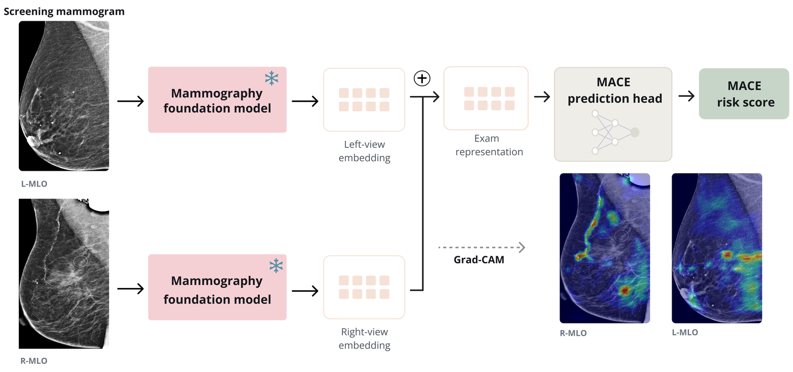

# Mammography Foundation Models for Opportunistic Prediction of Major Adverse Cardiovascular Events

<p align="center">
  <a href="https://arxiv.org/pdf/2609.19385"></a>
</p>

<p align="center">
  
</p>


Paula Feldman, Nusrat Binta Nizam, Sunwoo Kwak, Batuhan Karaman, Katerina Dodelzon,
Mert Sabuncu. Weill Cornell Medicine / Cornell Tech.

## Summary

We train a MLP on **frozen mammography foundation models** (Mammo-CLIP, Mammo-FM)to predict 5-year MACE directly from raw screening mammograms. No calcification segmentation
or BAC annotation is needed anywhere in the pipeline: the exam-level embedding
alone gets AUROC ≈ 0.82 (vs. 0.765 age-only, 0.859 full tabular), and Grad-CAM
shows the models attend to vessel-like structures without ever being told where they are.

## Results (held-out test set, n = 5,287; 118 events)

| Model       | AUROC | 95% CI          |
|-------------|-------|-----------------|
| Age-only    | 0.765 | [0.722, 0.805]  |
| Tabular     | 0.859 | [0.825, 0.889]  |
| Mammo-CLIP  | 0.823 | [0.785, 0.856]  |
| Mammo-FM    | 0.822 | [0.784, 0.858]  |

At the top 20% of predicted risk, Mammo-CLIP and Mammo-FM each captured 68.6% of
future MACE events at 7.7% precision (~3.4-fold enrichment over the base rate).

## Repository contents

This repo ships the code at a high level: frozen-encoder wrappers,
the MLP training arms, and cross-arm statistical comparison, not a runnable
end-to-end pipeline. Cohort construction / patient labeling isn't included (that
code runs directly against identifiable institutional EHR and DICOM data), and
data loading is a **placeholder**: `ExamDataset` in `dataset.py` defines the
expected interface but expects you to point `cohort_csv` at your own data.

```
src/mammo_cvd/
  dataset.py                                DICOM loading/preprocessing utilities +
                                             ExamDataset (placeholder, plug in your data)
  mammo_clip_features.py / mammo_fm_features.py   frozen EfficientNet-B5 encoder wrappers
                                             (needs the public weights)
  extract_embeddings_scankeyed.py           precompute per-view embeddings
  train_finetune_simplefusion_scankeyed.py  mean-pool + MLP head trainer (image arms)
  train_finetune_tabular_only.py / train_age_only.py   baselines
  compare_arms.py                           bootstrap CIs + DeLong tests across arms
```

Expected cohort CSV schema: one row per instance: `patientID, study_date, label_5yr,
path_L_MLO, path_R_MLO, age_at_baseline` — plus a `splits.csv` (`patient_id, split`) and,
for the tabular arm, a `tabular_features.csv` of per-patient risk factors.

## Setup

```bash
pip install torch pandas numpy scikit-learn matplotlib pillow pydicom requests
```

| Variable                        | Purpose                                        |
|----------------------------------|------------------------------------------------|
| `MAMMOCVD_ROOT`                  | repo checkout root (default: current directory)|
| `MAMMOCVD_FINETUNE_COHORT_CSV`   | path to your cohort CSV (schema above)         |
| `MAMMO_CLIP_REPO` / `MAMMO_CLIP_CKPT` | local [Mammo-CLIP](https://github.com/batmanlab/Mammo-CLIP) clone + checkpoint (`shawn24/Mammo-CLIP` on HF) |
| `MAMMO_FM_CKPT`                  | Mammo-FM checkpoint (`batmanlab/Mammo-FM` on HF) |

Pipeline, given a cohort CSV: `extract_embeddings_scankeyed.py` →
`train_finetune_simplefusion_scankeyed.py` (image arms) /
`train_finetune_tabular_only.py` / `train_age_only.py` (baselines) →
`compare_arms.py` (bootstrap CIs + DeLong tests across arms).

## Citation

```
@article{feldman2026mammocvd,
  title   = {Mammography Foundation Models for Opportunistic Prediction of Major Adverse Cardiovascular Events},
  author  = {Feldman, Paula and Nizam, Nusrat Binta and Kwak, Sunwoo and Karaman, Batuhan and Dodelzon, Katerina and Sabuncu, Mert},
  journal = {arXiv preprint},
  year    = {2026},
  eprint  = {2609.19385},
  archivePrefix = {arXiv}
}
```
